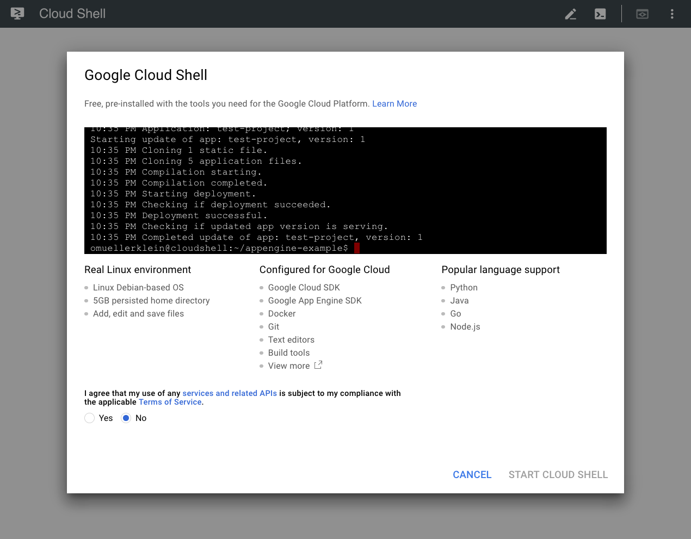

# Google Cloud Shell 

A free Linux terminal that you can access in your web browser. Cloud Shell can be used to manage your GCP resources or to quickly run Linux commands.

- Access a Linux terminal from your web browser 
- Preview changes to VM instances from the Cloud Shell interface 

### 1. Start Cloud Shell 

Google Cloud Shell can be accessed by visiting the [web page here](https://cloud.google.com/shell/). 

Cloud Shell is pre-installed with population languages and libraries, including:

- Python 
- Java
- Node.js 



### 2. Running a simple Python function

We can startup a Cloud Shell instance and quickly run Python script in a Linux terminal (**for free!**). 

```
python 

>>> import numpy as np
>>> x = np.array([[1, 2], [3, 4]])
>>> print(np.sum(x))
# 10
``` 

### 3. Clone a repo 

Cloud Shell can be used to run and preview an app locally before deploying it to your GCP resources. 

```
git clone https://github.com/GoogleCloudPlatform/appengine-guestbook-python \
    && cd appengine-guestbook-python \
    && dev_appserver.py ./app.yaml
```

After previewing the app locally, deploy to the cloud: 

```
gcloud app deploy ./index.yaml ./app.yaml 
```

The app can be found at the URL <code>https://[PROJECT_ID].appspot.com</code>.

### 4. Run an interactive tutorial 

Cloud Shell can be used with Markdown to create interactive tutorials.

An example tutorial can be found at [this Github repo.](https://github.com/GoogleCloudPlatform/cloud-shell-tutorials)

We can cloud the repo directly in Cloud Shell and open the **tutorial.md** file: 

```
cloudshell_open --repo_url "https://github.com/G
oogleCloudPlatform/cloud-shell-tutorials" --page "editor" --tutorial "tutori
al.md"
```

And we are ready to go with an interactive tutorial! 