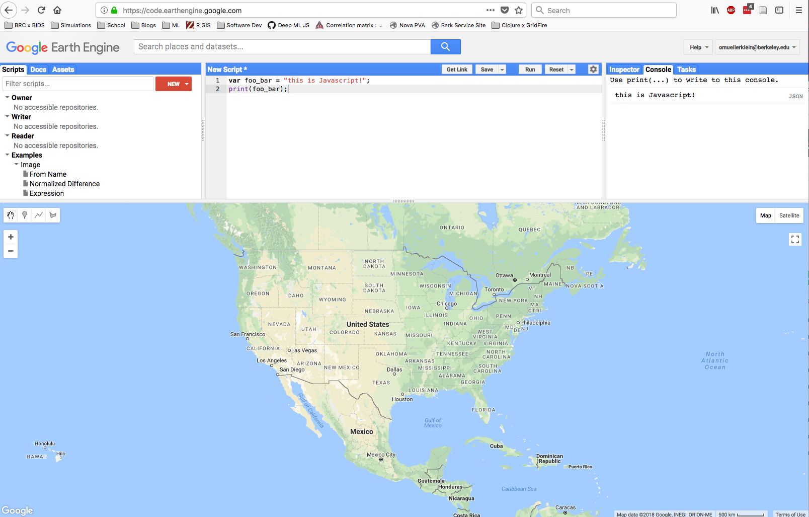
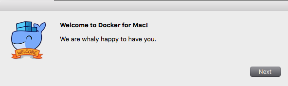
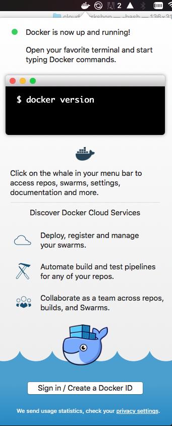
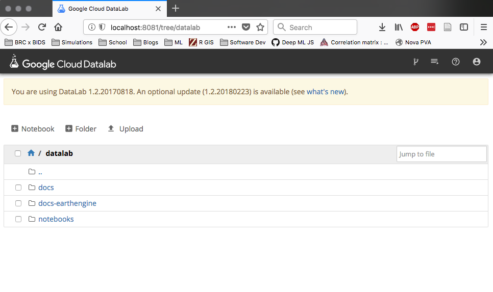
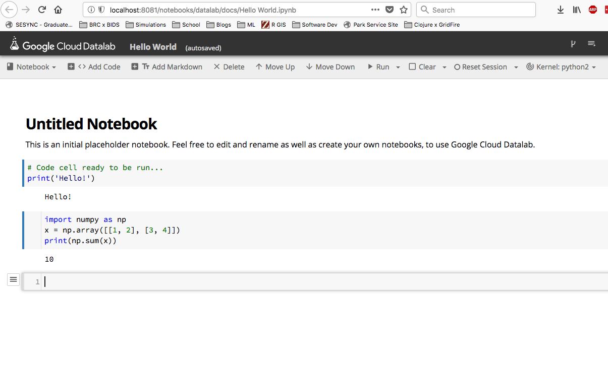
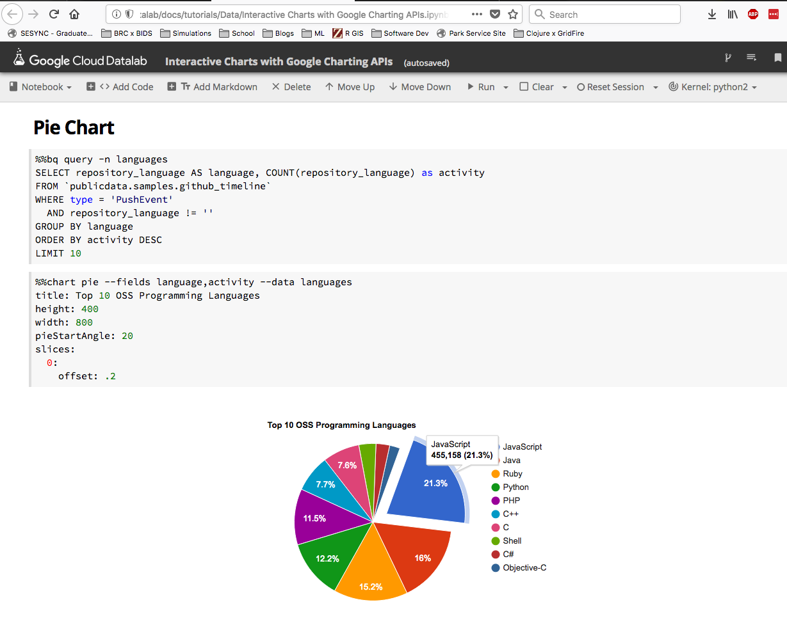

# Google Earth Engine 

This example will cover using a Google Cloud API (Google Earth Engine) within a Jupyter Notebook for research. 

### 1. Overview of Google Earth Engine 

There are several Google Cloud APIs that can be used for research, including:

- Compute APIs for managing container-applications *(e.g. Docker containers)* 
- Database APIs for managing MySQL instances 
- Big Data Genomics API
- Machine Learning: Natural Language API 
- Machine Learning: Cloud Speech API for speech recognition  

The Google Earth Engine (GEE) API can be used for geospatial research and development. Users can connect with the GEE API through either Javascript or Python.   

### 2. GEE API  

The GEE API can be accessed with either Javascript or Python. In addition, Google has an online Integrated Development Environment (IDE) for "rapid prototyping and visualization of complex spatial analyses using the Javascript API". 



### 3. Local GEE API Development 

Running a Docker container of GEE API for local development. 

Developing locally allows researchers to create a reproducible workflow before running on the Google Cloud Platform.

#### i) Install Docker 

Install the Docker application from the platform website (https://docs.docker.com/install)

  

After successful local installation we can use the Command-line tools.



#### ii) Create Earth Engine Container

The Python Development Environment for the GEE API contains: 

- **Earth Engine Python API**
- **Cloud Datalab** - a Jupyter notebook server 
- Various dependencies for visualizations of geospatial processing 

Setup GEE + Datalab workspace:

```
export GCP_PROJECT_ID=example_project_id
export CONTAINER_IMAGE_NAME=gcr.io/earthengine-project/datalab-ee:latest
export WORKSPACE=${HOME}/workspace/datalab-ee
mkdir -p $WORKSPACE
cd $WORKSPACE
``` 

Create a new container: 

```
docker run -it -p "127.0.0.1:8081:8080" -v "$WORKSPACE:/content" -e "PROJECT_ID=$GCP_PROJECT_ID" $CONTAINER_IMAGE_NAME
```

#### iii) Starting localhost 

Datalab starts as a <code>localhost</code> running on port <code>:8081</code>

**In Terminal / Command-Line:**
```
Starting Datalab in silent mode, ... 
Open your browser to http://localhost:8081/ to connect to Datalab
```

And open a web browser at <code>http://localhost:8081/</code>



#### iv) Hello World notebook 

Navigate to:
> /docs/Hello World.ipynb

Let's run the following sample script: 

```
import numpy as np 
x = np.array([[1, 2], [3, 4]])
print(np.sum(x))
```

We have an active notebook that can be used with interactively for Python development. 



#### v) Interactive data visualization  

Navigate to: 
> /docs/tutorials/Data/Interactive Charts with Google Charting APIs.ipynb

This demo illustrates the use of the Google Charting API with a Datalab notebook to easily create interactive plots for data visualization.

  

#### vi) Authenticate Earth Engine 

Navigate to:
> /notebooks/docs-earthengine  

Open authentication notebook: 
> authorize_notebook_server.ipynb 

**Note:** if *earthengine* is not installed, you can run the steps from [this tutorial](https://developers.google.com/earth-engine/python_install_manual) in your terminal.

#### vii) Sample Earth Engine script 

We can use the Datalab notebook to run scripts that use either the Python or Javascript Google Earth Engine APIs.

The following script connects with Earthengine and prints the metadata of an image pulled from the API: 

```
### Example from Google Earth Engine API web page 

# Import the Earth Engine Python Package
import ee

# Initialize the Earth Engine object, using the authentication credentials.
ee.Initialize()

# Print the information for an image asset.
image = ee.Image('srtm90_v4')
print(image.getInfo())
``` 

**From the command-line**


**From a Datalab notebook**

Run the following in the notebook to download elevation data from NASA Shuttle Radar Topography Mission and print the path of a download URL.

```
# Get a download URL for an image.
image1 = ee.Image('srtm90_v4')
path = image1.getDownloadUrl({
    'scale': 30,
    'crs': 'EPSG:4326',
    'region': '[[-120, 35], [-119, 35], [-119, 34], [-120, 34]]'
})
print path
```

### 4. GEE API Container on Google Cloud Platform 

Local GEE API develop with Jupyter Notebook  

**Note: running Datalab on the Google Cloud Platform (GCP) will incur charges** 

#### Stop your instance 

VMs that are stopped do not incur charges 

#### Delete your instance and notebooks

Deleting an instance and notebook will delete all files within the container.  

### 5. GEE Trainings and Research Awards 

- Google opens up Earth Engine Research Awards for proposals once a year (*early December*)

- Earth Engine Developers mailing list contains GEE staff and users with example scripts 

- Information on Earth Engine User Summit and Geo for Good conference sent out over GEE mailing list 

#### Signup / enroll 

https://earthengine.google.com/signup  