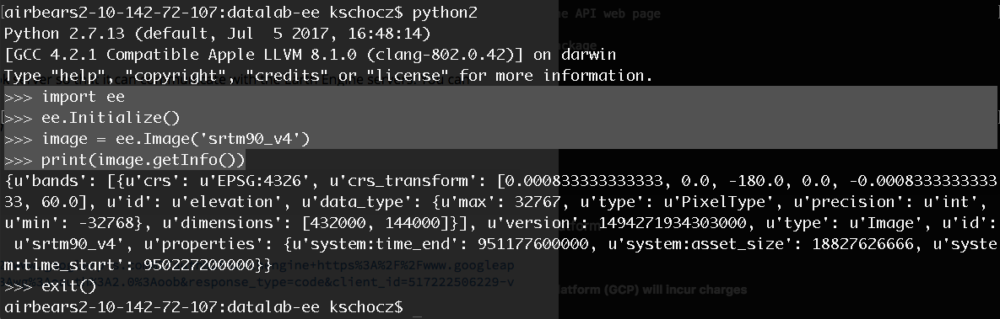

# Google Cloud APIs 

This example will cover using Google Cloud APIs (*e.g. Google Earth Engine*) within a Jupyter Notebook for research.

## Overview of Google Earth Engine 

There are several Google Cloud APIs that can be used for research, including:

- Compute APIs for managing container-applications *(e.g. Docker containers)* 
- Database APIs for managing MySQL instances 
- Big Data Genomics API
- Machine Learning: Natural Language API 
- Machine Learning: Cloud Speech API for speech recognition  

The Google Earth Engine (GEE) API can be used for geospatial research and development. Users can connect with the GEE API through either Javascript or Python.

## Cows Align North-South   

In 2008, a group of researchers in Germany went through satellite images of cows to measure the direction they align their bodies (*north, south, east, west*).

[A review of the study can be found here.](https://www.wired.com/2013/11/cow-compass-points-the-way-north/)

After reviewing the directions of thousands of cows, researchers found that cows tend to **align north-south.**

## Our Cow Study 

What if we wanted to use the cloud to find the direction cows face?

### 1. Google Earth Engine

The Google Earth Engine offers an Intergrated Development Environment (IDE) for "rapid prototyping and visualization of complex spatial analyses using the Javascript API."  

We can use the Google Earth Engine IDE to interactively explore locations and directions of cows.    


**What is an API?** 

As researchers with limited time, we do not want to have to manually click through thousands of cow images to calculate their direction. We want to automate the process. 

An API allows us to automate the process of clicking through images by providing functions and data that we can connect to and use.   

### 2. Automate Calculating Cow Alignment

We can use the Javascript API to perform geospatial / GIS calculations using functions provided by Earth Engine.

Within the IDE, we can prototype the automated process of going through cow images and calculating their direction.

Once we are done prototyping and have a workflow ready we can move to using the Google Earth Engine API in a notebook environment.   

### 3. A Cow, an API, and a Notebook  

Running a Docker container of GEE API for local development. 

Developing locally allows researchers to create a reproducible workflow before running on the Google Cloud Platform.

#### i) Install Docker 

Install the Docker application from the platform website (https://docs.docker.com/install)

#### ii) Create Earth Engine Container

The Python Development Environment for the GEE API contains: 

- **Earth Engine Python API**
- **Cloud Datalab** - a Jupyter notebook server 
- Various dependencies for visualizations of geospatial processing 

Setup GEE + Datalab workspace:

```
export GCP_PROJECT_ID=example_project_id
export CONTAINER_IMAGE_NAME=gcr.io/earthengine-project/datalab-ee:latest
export WORKSPACE=${HOME}/workspace/datalab-ee
mkdir -p $WORKSPACE
cd $WORKSPACE
``` 

Create a new container: 

```
docker run -it -p "127.0.0.1:8081:8080" -v "$WORKSPACE:/content" -e "PROJECT_ID=$GCP_PROJECT_ID" $CONTAINER_IMAGE_NAME
```

#### iii) Starting localhost 

Datalab starts as a <code>localhost</code> running on port <code>:8081</code>

**In Terminal / Command-Line:**
```
Starting Datalab in silent mode, ... 
Open your browser to http://localhost:8081/ to connect to Datalab
```

And open a web browser at <code>http://localhost:8081/</code>


#### iv) Hello World notebook 

Navigate to:
> /docs/Hello World.ipynb

Let's run the following sample script: 

```
import numpy as np 
x = np.array([[1, 2], [3, 4]])
print(np.sum(x))
```

We have an active notebook that can be used with interactively for Python development. 


#### v) Authenticate Earth Engine 

Navigate to:
> /notebooks/docs-earthengine  

Open authentication notebook: 
> authorize_notebook_server.ipynb 

**Note:** if *earthengine* is not installed, you can run the steps from [this tutorial](https://developers.google.com/earth-engine/python_install_manual) in your terminal.

#### vi) Sample Earth Engine script 

We can use the Datalab notebook to run scripts that use either the Python or Javascript Google Earth Engine APIs.

The following script connects with Earthengine and prints the metadata of an image pulled from the API: 

```
### Example from Google Earth Engine API web page 

# Import the Earth Engine Python Package
import ee

# Initialize the Earth Engine object, using the authentication credentials.
ee.Initialize()

# Print the information for an image asset.
image = ee.Image('srtm90_v4')
print(image.getInfo())
``` 

**From the command-line**



**From a Datalab notebook**

Run the following in the notebook to download elevation data from NASA Shuttle Radar Topography Mission and print the path of a download URL.

```
# Get a download URL for an image.
image1 = ee.Image('srtm90_v4')
path = image1.getDownloadUrl({
    'scale': 30,
    'crs': 'EPSG:4326',
    'region': '[[-120, 35], [-119, 35], [-119, 34], [-120, 34]]'
})
print path
```


### 4. Seeing Cow Directions with an API

We want to take a look at our results with data visualization 

We can build interactive charts with the Google Charting API.    

Navigate to: 
> /docs/tutorials/Data/Interactive Charts with Google Charting APIs.ipynb

This demo illustrates the use of the Google Charting API with a Datalab notebook to easily create interactive plots for data visualization.

  

### 5. Send Cows to the Cloud    

**Note: running Datalab on the Google Cloud Platform (GCP) will incur charges** 

We are ready to send cows to the cloud! 

In other words, we want to start instances of VMs in the cloud for computation. 

We have two options for sending off cows: 

1. Use gcloud commands from our notebook 
2. Use gcloud commands from Cloud Shell 

#### Stop your instance 

VMs that are stopped do not incur charges 

#### Delete your instance and notebooks

Deleting an instance and notebook will delete all files within the container.  

### 6. Machine Learning and Cows 

Now we want to run machine learning on the cow data to make better predictions.  

The following example uses Google's TensorFlow machine learning framework to run a model across a distribution of VM instances in the cloud. Further, the status of the model can be visualized directly in a local Datalab notebook with some other Google APIs.  

[GCP tutorial for TensorFlow across VMs](https://cloud.google.com/solutions/running-distributed-tensorflow-on-compute-engine)

## Trainings and Research Awards 

- Google opens up Earth Engine Research Awards for proposals once a year (*early December*)

- Earth Engine Developers mailing list contains GEE staff and users with example scripts 

- Information on Earth Engine User Summit and Geo for Good conference sent out over GEE mailing list 

#### Signup / enroll 

https://earthengine.google.com/signup  

[**Next: Review**](Review.md)